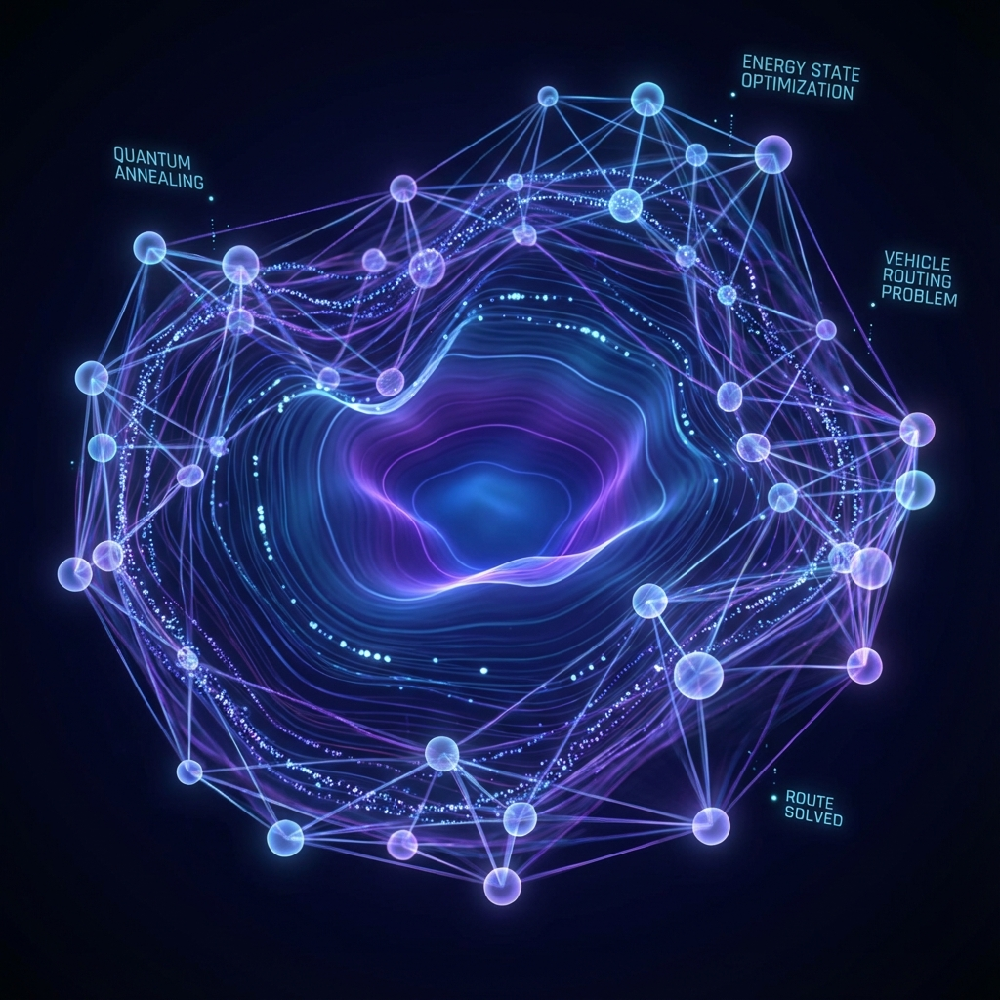

# Quantum Logistics Simulator: 社会実装へ向けた提案書

## 1. 社会課題の背景

### 物流クライシスと「2024年問題」
現代社会において、物流は生命線ですが、深刻なドライバー不足や長時間労働の規制強化（2024年問題）により、**「運べないリスク」**が現実のものとなっています。
特に都市部のラストワンマイル配送においては、複雑な道路事情や再配達の増加により、従来の配送計画では限界が見えています。

- **ドライバー不足**: 労働力人口の減少と高齢化。
- **効率化の限界**: 熟練ドライバーの勘に頼ったルート作成は属人化しており、継承が困難。
- **CO2削減**: 無駄な移動は燃料消費を増やし、環境負荷を高める。

### 私たちが解決すること
配送車両（全エージェント）の動きを**「全体最適（Global Optimization）」**の視点で制御し、総移動距離と時間を最小化することで、限られたリソースでの最大効率化を実現します。

## 2. 提案するソリューション

**Quantum Logistics Simulator** は、量子アニーリング技術を活用した次世代の配送管理システムです。
従来の手法では計算量が爆発してしまう「複数車両の配送計画問題（VRP）」を、量子コンピュータ（およびそのシミュレータ）上で高速に解くことを目指しています。

### 主な特徴
1.  **リアルタイム全体最適化**:
    状況の変化（新たな配送依頼、渋滞、車両の故障など）に応じて、瞬時に全車両のルートを再計算します。
2.  **マルチエージェント協調**:
    個々の車両が勝手に最短経路を選ぶのではなく、システム全体として最も効率が良いように「役割分担」と「経路選択」を同時に行います。
3.  **確実な配送と帰還**:
    全ての目的地を確実に訪問し、配送完了後は全エージェントがデポ（出発地点）へ帰還します。

## 3. 技術的アプローチ: 二段階QUBO最適化

本プロジェクトでは、VRPを2つのサブ問題に分解し、それぞれをQUBOで解く**二段階最適化**アプローチを採用しました。

| Phase | 問題 | 定式化 | 保証 |
|-------|------|--------|------|
| **Phase 1** | 割り当て (Clustering) | Assignment QUBO | 全目的地が必ず誰かに割り当てられる |
| **Phase 2** | 巡回順序 (Routing) | Position-based TSP QUBO | 全目的地を1回ずつ訪問し、デポへ帰還 |

---

### Phase 1: 割り当て問題 (Assignment QUBO)

各目的地 $i$ を、どのドライバー $k$ が担当するかを決定します。

**決定変数:**

$$ y_{k,i} \in \{0, 1\} $$

($y_{k,i} = 1$ ならドライバー $k$ が目的地 $i$ を担当)

**制約: 各目的地は必ず1人に割り当て (One-Hot)**

$$ H_{\text{assign}} = A \sum_{i=1}^{N} \left( \sum_{k=1}^{K} y_{k,i} - 1 \right)^2 $$

**目的: 割り当ての距離最小化 + 負荷分散**

$$ H_{\text{dist}} = B \sum_{k} \sum_{i} d(\text{pos}_k, i) \cdot y_{k,i} $$

$$ H_{\text{balance}} = C \sum_{k} \sum_{i < j} y_{k,i} \cdot y_{k,j} $$

---

### Phase 2: 巡回問題 (TSP QUBO - Closed Loop)

各ドライバーに割り当てられた目的地群に対して、Position-based TSP を解きます。

**決定変数:**

$$ z_{i,p} \in \{0, 1\} $$

($z_{i,p} = 1$ なら目的地 $i$ を訪問順序 $p$ で訪れる)

**制約1: 各目的地は1回だけ訪問 (Row One-Hot)**

$$ H_{\text{row}} = A \sum_{i=1}^{n} \left( \sum_{p=1}^{n} z_{i,p} - 1 \right)^2 $$

**制約2: 各順序には1つの目的地 (Column One-Hot)**

$$ H_{\text{col}} = A \sum_{p=1}^{n} \left( \sum_{i=1}^{n} z_{i,p} - 1 \right)^2 $$

**目的: 総移動距離の最小化 (帰還込み)**

$$ H_{\text{tsp}} = B \left[ \sum_{i} d(\text{start}, i) z_{i,0} + \sum_{p=0}^{n-2} \sum_{i \neq j} d(i, j) z_{i,p} z_{j,p+1} + \sum_{i} d(i, \text{depot}) z_{i,n-1} \right] $$

最終項 $d(i, \text{depot}) z_{i,n-1}$ により、最後の目的地からデポへの帰還コストが明示的に最小化されます。

---

### 実装構成
- **言語**: Python (FastAPI Backend, Vanilla JS Frontend)
- **ソルバ**: OpenJij (Simulated Annealing) + Dimod (BQM Construction)
- **分割統治**: 大規模問題 (9目的地以上/ドライバー) は Greedy 法にフォールバック

## 4. デモンストレーション

本デモアプリでは、この技術をブラウザ上で視覚的に体験できます。

- **Scenario**: センター（DEPOT）から出発する複数の配送トラック。
- **Action**: 目的地はランダムに生成され、量子モデルが瞬時に最適ルートを割り当てます。
- **Responsiveness**: エージェントが移動するたびに再計算が走り、動的な最適化が可視化されます。
- **Completion**: 全配送完了後、全エージェントがデポへ帰還します。

## 5. 今後の展望

現在はシミュレータ（OpenJij）上で動作していますが、このQUBOモデルはそのまま**実機の量子アニーリングマシン（D-Wave等）**に送信して解かせることが可能です。
物流だけでなく、ドローンの群制御、災害時の避難誘導、工場のAGV搬送など、あらゆる「移動と割当の最適化」に応用できる基盤技術となります。
